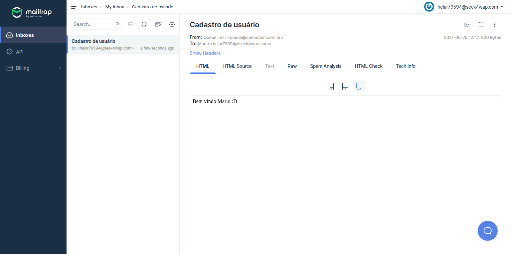

# queuenode
Testing node queue using bull

# Setup 
```shell
git clone https://github.com/stdioh321/queuenode.git
cd queuenode
npm install
```

# Setup Mailtrap
We use mailtrap as a mock for the smtp server.

Go to: **https://mailtrap.io/inboxes**, and access "My Inbox".

Credentials:

>User: helar79594@seek4wap.com

>Pass: 12345678

|All Inboxes|My Inbox|
|---|---|
||| 

# Run
In order to run this application it is necessary to run a Redis server along with it, to do it we use the docker.
```shell
docker run --name redis -p 6379:6379 -d -t --rm redis:alpine
npm run dev
```


# Executing
```shell
curl "http://localhost:3333/users" -H "Content-Type: application/json"  --data '{"name":"John", "email":"john@test.com", "password": "12345678"}'
```
Check the mailtrap to see if the email arrived.


# BullBoard
Go to **http://localhost:3333/admin** to see the BullBoard.


# References
* [Youtube Tutorial](https://www.youtube.com/watch?v=uonKHztGhko)
* S[Bull](https://github.com/OptimalBits/bull)